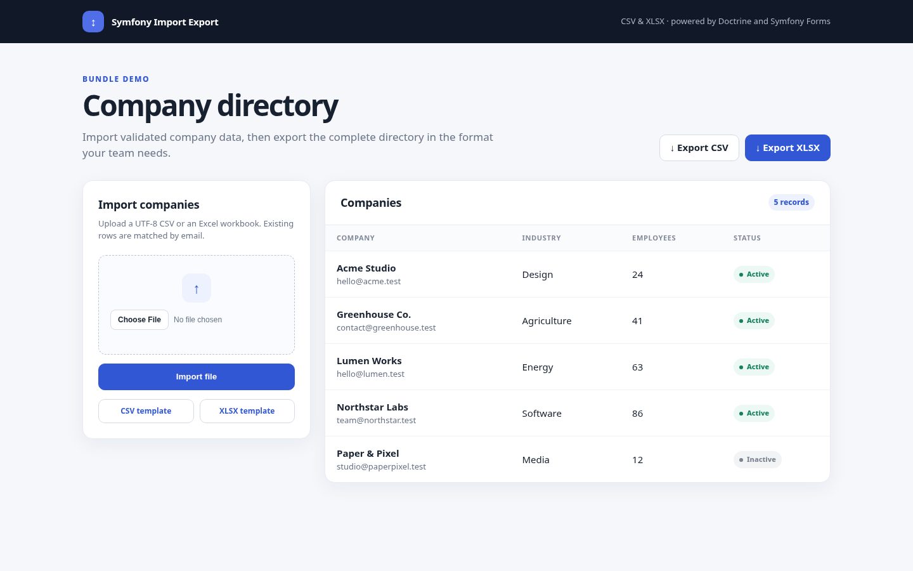

# Symfony Import Export Bundle

Import and export Doctrine entities from Excel and CSV in Symfony applications.

[](https://github.com/HugoSEIGLE/symfony-import-export-bundle/actions/workflows/test.yaml)
[](https://packagist.org/packages/hugoseigle/symfony-import-export-bundle)
[](https://packagist.org/packages/hugoseigle/symfony-import-export-bundle/stats)
[](https://packagist.org/packages/hugoseigle/symfony-import-export-bundle/stats)
[](https://github.com/HugoSEIGLE/symfony-import-export-bundle/stargazers)
[](https://github.com/HugoSEIGLE/symfony-import-export-bundle/releases)
[](LICENSE)



## Features

- Streamed CSV export and CSV/XLSX import and export.
- Ordered, translated headers and downloadable import templates.
- Symfony Form validation and data transformation for every imported row.
- Doctrine metadata conversion for booleans, dates, backed enums, and associations.
- Create, update, and optional delete candidates identified by configured unique fields.
- Structured row errors without automatic database writes.
- Configurable date, boolean, CSV, BOM, and strict-header behavior.

## Requirements

- PHP 8.1 or newer
- Symfony 6.4, 7.x, or 8.x
- Doctrine ORM 3.2 or newer within 3.x
- PhpSpreadsheet 2.3.5 or newer within 2.x

## Installation

```bash
composer require hugoseigle/symfony-import-export-bundle
```

## Bundle activation

Symfony Flex normally registers bundles. If it does not, add:

```php
// config/bundles.php
return [
    HugoSEIGLE\SymfonyImportExportBundle\SymfonyImportExportBundle::class => ['all' => true],
];
```

## Minimal configuration

```yaml
# config/packages/import_export.yaml
import_export:
    date_format: 'Y-m-d'
    importers:
        App\Entity\Company:
            fields: [name, email, active]
            unique_fields: [email]
```

Field order is column order. Strict header validation is enabled by default. See [installation](docs/installation.md) for all requirements.

## First export

Inject `ExporterInterface`, pass it a Doctrine ORM `Query`, getter names in column order, a base filename, and a format:

```php
use HugoSEIGLE\SymfonyImportExportBundle\Services\Export\ExporterInterface;

$query = $companyRepository->createQueryBuilder('company')->getQuery();

return $exporter->export(
    $query,
    ['getName', 'getEmail', 'isActive'],
    'companies',
    ExporterInterface::CSV, // or ExporterInterface::XLSX
);
```

CSV rows stream from `Query::toIterable()`. XLSX iterates the query but retains workbook cells in memory. See [exporting](docs/export.md).

## First import

Create a Symfony form type containing every configured field, then pass an uploaded `.csv` or `.xlsx` file to `ImporterInterface`:

```php
use App\Entity\Company;
use App\Form\CompanyImportType;
use HugoSEIGLE\SymfonyImportExportBundle\Services\Import\ImporterInterface;

$result = $importer->import(
    $uploadedFile,
    Company::class,
    CompanyImportType::class,
);
```

The result exposes `getCreatedEntities()`, `getUpdatedEntities()`, and `getDeletedEntities()`. The bundle does not persist, remove, flush, or start a transaction; your application decides whether and how to apply candidates. See [importing](docs/import.md).

## Validation and error handling

```php
use HugoSEIGLE\SymfonyImportExportBundle\Services\Import\ImportError;

if (!$result->isValid()) {
    $errors = array_map(static fn (ImportError $error): array => [
        'row' => $error->row,
        'field' => $error->field,
        'message' => $error->message,
        'value' => $error->value,
    ], $result->getErrors());
}
```

Header mismatches stop the import. Row errors accumulate while later rows continue. Persist only after applying your chosen all-or-partial import policy; [validation guidance](docs/validation.md) shows the relevant edge cases.

## Supported formats

| Operation | CSV | XLSX |
| --- | :---: | :---: |
| Import | Yes | Yes |
| Export | Yes | Yes |
| Empty import template | Yes | Yes |

Only `.csv` and `.xlsx` imports are implemented. CSV is expected to be UTF-8; a first-header BOM is accepted. XLSX formulas are read from stored values without formula evaluation.

## Customization

Configure global date/boolean formatting, strict headers, CSV delimiter/enclosure/escape/BOM, entity fields, unique fields, and deletion:

```yaml
import_export:
    bool_true: 'yes'
    bool_false: 'no'
    validate_headers: true
    csv:
        delimiter: ';'
        enclosure: '"'
        escape: ''
        bom: true
    importers:
        App\Entity\Company:
            fields: [name, email, active]
            unique_fields: [email]
            allow_delete: true
```

The optional `deleted` column is added only with `allow_delete: true`. Per-call `allowDelete`, `allowCreate`, and `allowUpdate` flags can further restrict operations. Headers use `import_export.<snake_case_name>` keys from the application `messages` translation domain. See [customization](docs/customization.md).

## Extension points

The bundle dispatches no events. Extend behavior through Symfony form constraints and transformers, translations, runtime operation flags, configuration, or service decoration. `MethodToSnakeInterface`, `ExporterInterface`, `ImporterInterface`, and `ImporterTemplateInterface` are autowireable.

Generate a translated empty file with:

```php
return $templates->getImportTemplate(Company::class, ImporterInterface::XLSX);
```

## Demo

The [`demo/`](demo/) directory is a complete Symfony application backed by SQLite. It installs this bundle from the parent directory and demonstrates imports, validation feedback, downloadable templates, and CSV/XLSX exports.

```bash
cd demo
composer install
composer setup
symfony serve
```

Then open the URL printed by Symfony CLI. A ready-to-import [`companies.csv`](demo/data/companies.csv) file is included. The smaller [Company example](examples/README.md) remains available for copying individual files into an existing application.

## Compatibility

| Bundle | PHP | Symfony | Doctrine ORM | PhpSpreadsheet |
| --- | ---: | ---: | ---: | ---: |
| 2.x | >= 8.1 | 6.4 / 7.x / 8.x | >= 3.2, < 4.0 | >= 2.3.5, < 3.0 |

Composer also enforces each Symfony release's own PHP requirement. Version 1.x users must follow the [upgrade guide](docs/upgrading.md), especially for the canonical `HugoSEIGLE\SymfonyImportExportBundle` namespace and result-based import API.

## Tests and quality

```bash
composer validate --strict
composer dump-autoload --optimize --strict-psr
composer test
composer lint
composer phpstan
```

CI runs supported PHP/Symfony combinations. `composer lint` is read-only.

## Contributing

Bug reports and focused pull requests are welcome. Read [CONTRIBUTING.md](CONTRIBUTING.md) before submitting changes.

## License

Released under the [MIT License](LICENSE).
